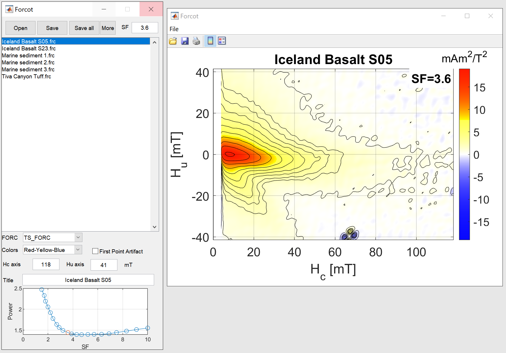

# Forcot
## Waiting for Forcot: Accelerating FORC Processing 100x using a Fast-Fourier-Transform Algorithm

Forcot is a new First-Order Reversal-Curve (FORC) processing software that uses a Fast-Fourier-Transform algorithm to accelerate smoothing significantly. Its aim is to provide as easy and frictionless a user-experience as possible to create print-quality FORC diagrams with minimum effort. 

When using the software to produce figures, or when using any of the code, theory, figures, data, please cite the corresponding paper 
Berndt, T. A. & Chang, L. (2019). Waiting for Forcot: Accelerating FORC Processing 100x using a Fast-Fourier-Transform Algorithm. Geochemistry, Geophysics, Geosystems.

* [Download latest version of Forcot](https://github.com/thomasberndt/Forcot/releases/latest)

For the Mac version, you may have to use the command  `sudo xattr -d com.apple.quarantine Forcot_MacInstaller_v1.x.x.app` (replace x by version number) to allow installing the app. Alternatively, you can download the [Matlab version](https://github.com/thomasberndt/Forcot/releases/latest) (this requires the curve fitting toolbox, the image toolbox, and the statistics toolbox).

# Mind the gap
## Towards a magnetic palaeo-environment proxy through an extensive full micromagnetic correlation of magnetosome chain morphology and hysteresis parameters

 
1. [Animated hysteresis loops of 10-element equant (cubic) magnetosome chains (field near parallel to chain axis)](https://thomasberndt.github.io/magnetosomes/mypages/equant_par.html)
1. [Animated hysteresis loops of 10-element equant (cubic) magnetosome chains (field near perpendicular to chain axis)](https://thomasberndt.github.io/magnetosomes/mypages/equant_par.html/equant_perp.html)
1. [Animated hysteresis loops of 10-element equant (cubic) magnetosome chains (field at intermediate angle to chain axis)](https://thomasberndt.github.io/magnetosomes/mypages/equant_par.html/equant_int.html)
1. [Animated hysteresis loops of 10-element elongated (e=1.4) magnetosome chains](https://thomasberndt.github.io/magnetosomes/mypages/equant_par.html/elongated.html)
1. [Remanent states of magnetosome chains](https://thomasberndt.github.io/magnetosomes/mypages/equant_par.html/remanentstate.html)
1. [Switching modes of magnetosome chains](https://thomasberndt.github.io/magnetosomes/mypages/equant_par.html/switchingmode.html)
1. [Animated hysteresis loops of strongly elongated bar-like particles of the same dimensions as a complete magnetosome chain](https://thomasberndt.github.io/magnetosomes/mypages/equant_par.html/bars.html)
1. [Remanent states of strongly elongated bar-like particles of the same dimensions as a complete magnetosome chain](https://thomasberndt.github.io/magnetosomes/mypages/equant_par.html/bars_remanent.html)
1. [Switching modes of strongly elongated bar-like particles of the same dimensions as a complete magnetosome chain](https://thomasberndt.github.io/magnetosomes/mypages/equant_par.html/bars_switching.html)
1. [TEM images of magnetosome chains](https://thomasberndt.github.io/magnetosomes/mypages/equant_par.html/TEM.html) 
1. [Additional plots of micromagnetic model](https://thomasberndt.github.io/magnetosomes/mypages/equant_par.html/plots.html)
1. [Additional plots of TEM analysis](https://thomasberndt.github.io/magnetosomes/mypages/equant_par.html/TEMplots.html)
1. [Additional plots about the angular dependence of switching](https://thomasberndt.github.io/magnetosomes/mypages/equant_par.html/angularplots.html)
1. [Comparison of magnetocrystalline anisotropies](https://thomasberndt.github.io/magnetosomes/mypages/equant_par.html/anisotropy.html)

